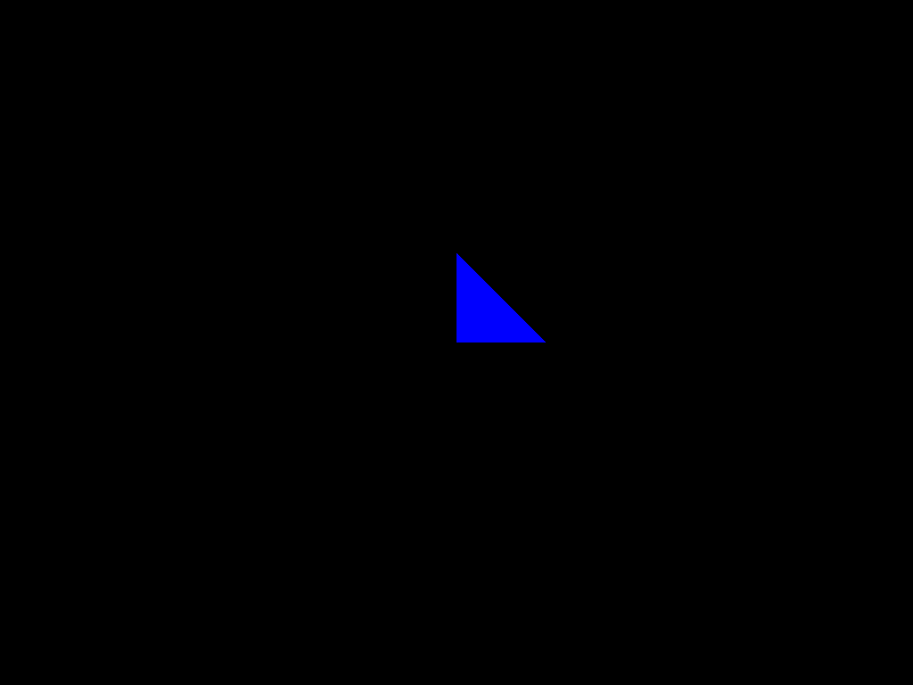

# Ray tracing
In dev. Obviously.

Example of a rendered sphere and triangle using ray-tracing

# References
* General idea: https://www.youtube.com/watch?v=gBPNO6ruevk
* Reference book: Ray-tracing gems: http://www.realtimerendering.com/raytracinggems/
* All there is: http://www.realtimerendering.com/raytracing.html
* Intersection between a line and a triangle: doi:10.1080/10867651.1997.10487468
    (and the wiki: https://en.wikipedia.org/wiki/M%C3%B6ller%E2%80%93Trumbore_intersection_algorithm )

# Done
- [x] Triplet Class
- [x] Colour Class
- [x] Vector3 Class
- [x] Image class. To have an array representing each pixel
- [x] Intersection between a ray and a triangle
- [x] Collision between ray and sphere.
- [x] Make the camera class
- [x] Make a geometry class (which has a color, and I guess later, texture,
  roughness, ...) and Triangle a daughter of it.

# TODO
- [ ] Properly treat several objects and go through them for rendering
- [ ] Collision between rays and general objects.
- [ ] Use R-tree?
- [ ] Read Blender OBJ files
- [ ] Parsing inputs: https://www.cplusplus.com/articles/DEN36Up4/

# How it works

* Start by placing objects in a 3d world.
* Consider looking at the world through a camera (~ 1 point at the center
  looking through a screen that has width x height pixels.)
* For each pixel, looking from the center towards that pixel and see if it
  encounters an object.
* If it encounters an object calculate the color, else give the "default
  background color" to that pixel.
