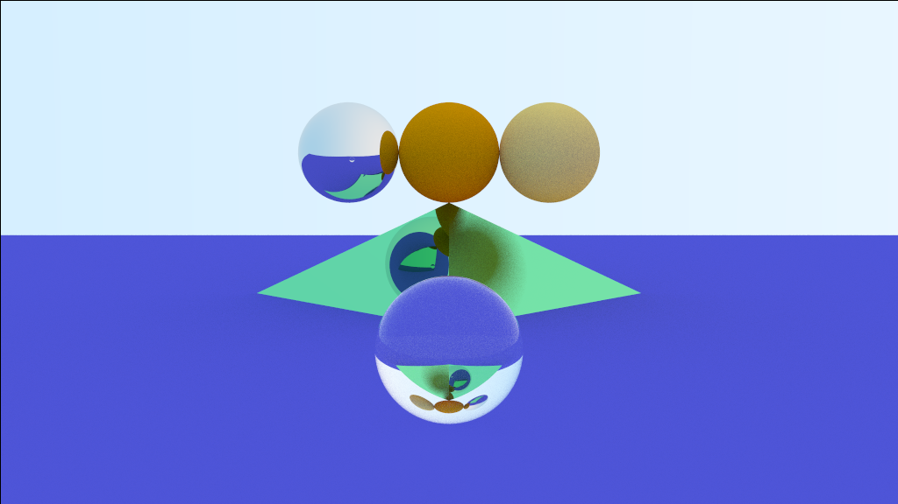

# Ray tracing
In dev. Obviously.

Example of rendered spheres and a pyramid using ray-tracing

# References
* General idea: https://www.youtube.com/watch?v=gBPNO6ruevk
* Reference book: Ray-tracing gems: http://www.realtimerendering.com/raytracinggems/
* All there is: http://www.realtimerendering.com/raytracing.html
* Intersection between a line and a triangle: doi:10.1080/10867651.1997.10487468
    (and the wiki: https://en.wikipedia.org/wiki/M%C3%B6ller%E2%80%93Trumbore_intersection_algorithm )
* Lambertian reflectance: https://en.wikipedia.org/wiki/Lambertian_reflectance
* Gamma Correction: https://en.wikipedia.org/wiki/Gamma_correction
* Schlick's approximation: https://en.wikipedia.org/wiki/Schlick%27s_approximation
* Fresnel's refraction: https://en.wikipedia.org/wiki/Fresnel_equations

# TODO
- [ ] Use R-tree?
- [ ] Read Blender OBJ files
- [ ] Texture on objects
- [ ] Collision between rays and general objects.
- [ ] Parsing inputs: https://www.cplusplus.com/articles/DEN36Up4/

# How it works

* Start by placing objects in a 3d world.
* Consider looking at the world through a camera (~ 1 point at the center
  looking through a screen that has width x height pixels.)
* For each pixel, looking from the center towards that pixel and see if it
  encounters an object.
* If it encounters an object calculate the color, else give the "default
  background color" to that pixel.

## How the colour is calculated

# Requirements
* C++ 11
